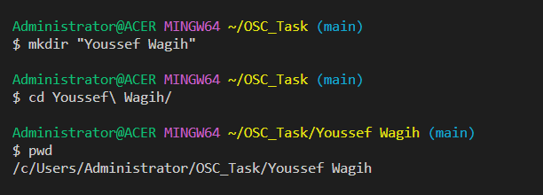
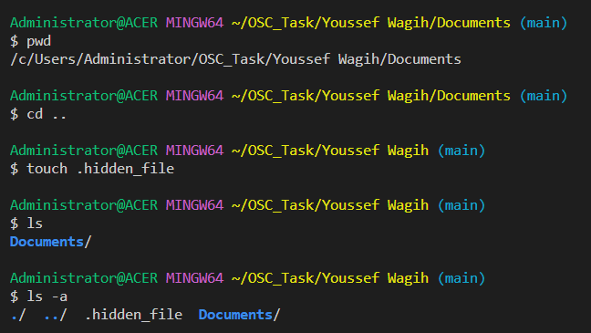

# Session 1: Introduction to Linux

## Task 1 - Submission

### Step 1. Create Your Directory

1. Open a terminal on your Linux system.
2. Create a directory with your first and last names, including spaces. Use the appropriate command to create the directory. ``` mkdir "Youssef Wagih" ```
3. Change your current working directory to the newly created directory. ``` cd Youssef\ Wagih/ ```


### Step 2. Make Another Directory and Create Multiple Files

1. Inside your directory, create another directory named "Documents." ``` mkdir Documents ```
2. Change your current working directory to the "Documents" subdirectory. ``` cd Documents/ ```
3. Create three text files named "file1.txt," "file2.txt," and "file3.txt" within the "Documents" directory, **all at once** using a single command. ``` touch file1.txt file2.txt file3.txt ```
4. Verify that all three files are created inside the "Documents" directory. ``` ls ```
 

### Step 3. Hide a File

1. Go back to your main directory (the one with your first and last names) using the appropriate command. ``` cd .. ```
2. Create a hidden file named ".hidden_file" within the main directory. ``` touch .hidden_file ```
3. Use the appropriate command to verify that the hidden file is created. ``` ls -a ```

