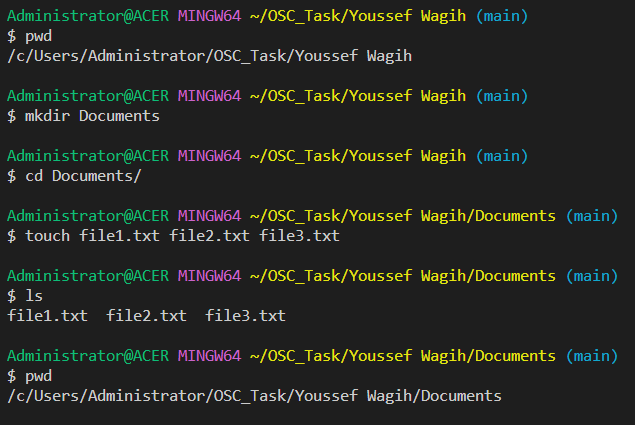

# Session 1: Introduction to Linux

## Task 1 - Submission

### Step 1. Create Your Directory

1. Open a terminal on your Linux system.
2. Create a directory with your first and last names, including spaces. Use the appropriate command to create the directory. ``` mkdir "Youssef Wagih" ```
3. Change your current working directory to the newly created directory. ``` cd Youssef\ Wagih/ ```


### Step 2. Make Another Directory and Create Multiple Files

1. Inside your directory, create another directory named "Documents." ``` mkdir Documents ```
2. Change your current working directory to the "Documents" subdirectory. ``` cd Documents/ ```
3. Create three text files named "file1.txt," "file2.txt," and "file3.txt" within the "Documents" directory, **all at once** using a single command. ``` touch file1.txt file2.txt file3.txt ```
4. Verify that all three files are created inside the "Documents" directory. ``` ls ```
 


### Step 3. Hide a File

1. Go back to your main directory (the one with your first and last names) using the appropriate command. ``` cd .. ```
2. Create a hidden file named ".hidden_file" within the main directory. ``` touch .hidden_file ```
3. Use the appropriate command to verify that the hidden file is created. ``` ls -a ```


### Step 4. Write with Nano

1. Use the Nano text editor to write a short message inside the "file1.txt" file you created in Step 2. ``` nano file1.txt ```
2. Save the changes and exit Nano. ``` CTRL+X Y ENTER ```
3. Display the contents of the "file1.txt" file to ensure your changes are saved. ``` cat file1.txt ```
   
  >Nano 

### Step 5. Go Back

1. Return to the "Documents" directory using the appropriate command. A bit strange since we ended in Documents directory in last step but here is a command that "returns" ``` cd .. ```
   

### Step 6. Create a Unique Directory

1. Create a new directory named "-" (a hyphen) within the "Documents" directory. ``` mkdir - ```
2. Change your current working directory to this newly created directory. ``` cd ./-/ ```
 

### Step 7. Copy Directory

1. Copy the "Documents" directory (and all its contents) to your main directory (the one with your first and last names) using the appropriate command. Give the copied directory a different name (e.g., "My_Documents"). ``` cp -r ../../Documents/ ../../My_Documents ```
2. Verify that the copy was successful by listing the contents of your main directory. ``` ls ../../My_Documents/ ```
 
