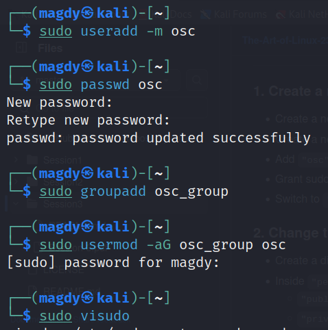
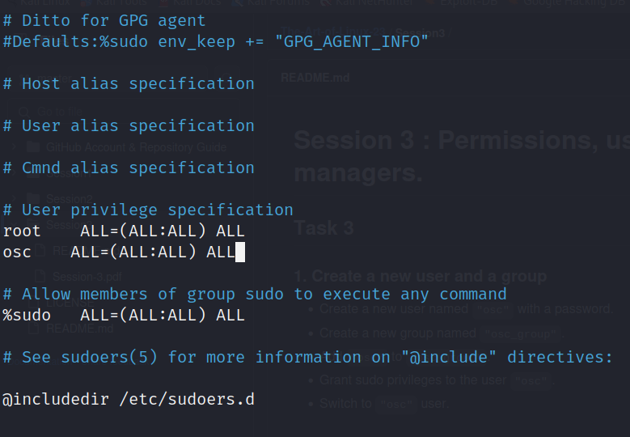
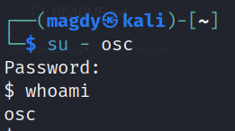

# Session 3 : Permissions, users, processes and package managers.
## Task 3 - Submission

### 1. Create a new user and a group

 Create a new user named `"osc"` with a password.

  ``` sudo useradd -m osc ```

  ``` sudo passwd osc ```
  
 Create a new group named `"osc_group"`.

  ``` sudo groupadd osc_group ```
  
 Add `"osc"` to `"osc_group"`.

  ``` sudo usermod -aG osc_group osc ```
  
 Grant sudo privileges to the user `"osc"`.

  ``` sudo visudo  ```

  Type "osc ALL=(ALL:ALL) ALL"

  C+X

   Y

  ENTER
  
 Switch to `"osc"` user.

 ``` su - osc ```

 
 
 
 
 
 
