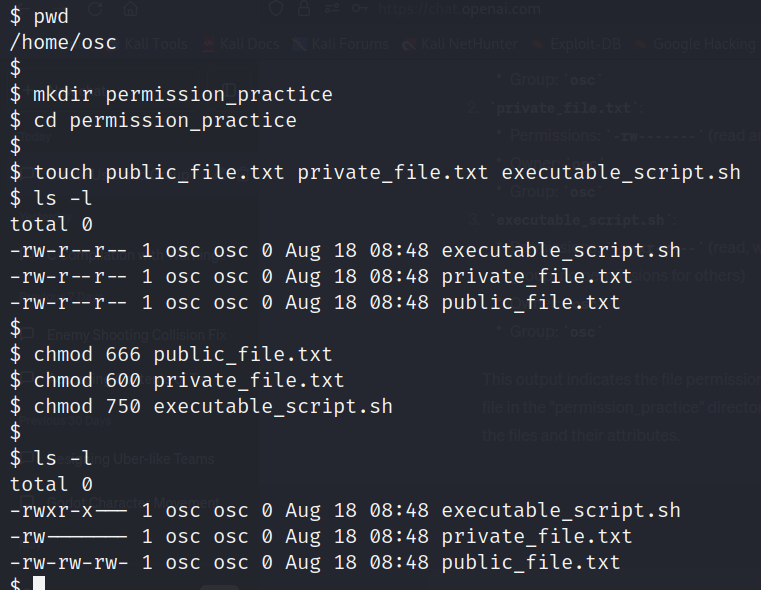
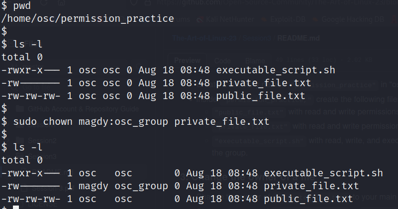
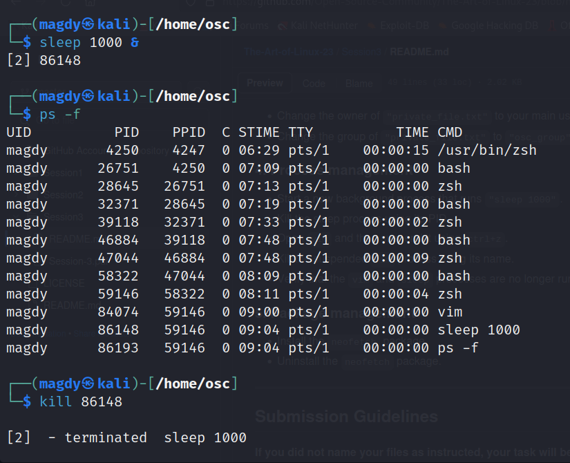
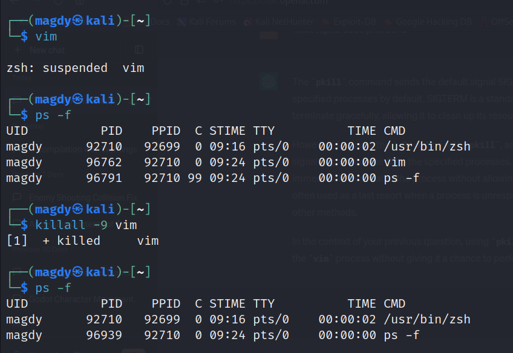

# Session 3 : Permissions, users, processes and package managers.
## Task 3 - Submission

### 1. Create a new user and a group

 Create a new user named `"osc"` with a password.

  ``` sudo useradd -m osc ```

  ``` sudo passwd osc ```
  
 Create a new group named `"osc_group"`.

  ``` sudo groupadd osc_group ```
  
 Add `"osc"` to `"osc_group"`.

  ``` sudo usermod -aG osc_group osc ```
  
 Grant sudo privileges to the user `"osc"`.

  ``` sudo visudo  ```

  Type "osc ALL=(ALL:ALL) ALL"

  C+X

   Y

  ENTER
  
 Switch to `"osc"` user.

 ``` su - osc ```


 
 
 
 
 
 


#### 2. Change the permissions of a file

- Create a directory named "permission_practice" in "osc"'s home directory.

``` pwd ```
``` mkdir permission_practice ```

``` cd permission_practice ```


- Inside "permission_practice," create the following files:

``` touch public_file.txt private_file.txt executable_script.sh ```
``` ls -l ```


   - "public_file.txt" with read and write permissions for everyone.
   
   ``` chmod 666 public_file.txt ```
   
   
   - "private_file.txt" with read and write permissions only for the owner.
   
   ``` chmod 600 private_file.txt ```
   
   
   - "executable_script.sh" with read, write, and execute permissions for the owner and read and execute permissions for the group.
   
   ``` chmod 750 executable_script.sh ```
   
   
   ``` ls -l ```
   
    





### 3. Change the owner of a file

- Change the owner of `"private_file.txt"` to your main user (the one you created when you installed Linux).

- Change the group of `"private_file.txt"` to `"osc_group"`.


``` sudo chown magdy:osc_group private_file.txt ```





### 4. Process management

- Start a new background process that runs `"sleep 1000"`.
- ``` sleep 1000 & ```


- Kill the sleep process using its PID.
- ``` ps -f ```
- ``` kill kill 86148 ```


- Open `vim` and then suspend it using `ctrl+z`.
- ``` vim ``` then, C+Z


- Kill the suspended `vim` process using its name.
- ``` killall -9 vim ```


- Verify that the `vim` and `sleep` processes are no longer running using the appropriate command.
- ``` ps -f ```



 



